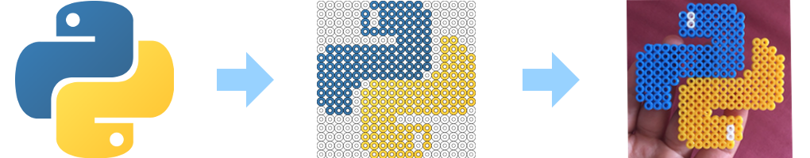

# PyHama

Tool written in Python to convert an image into a *pegboard* and using it as a template for *Hama Beads*.

## Installation

~~~bash
$ pipenv install
~~~

## Usage

~~~console
$ pipenv run python pyhama -h
~~~

~~~
PyHama

Usage:
    pyhama [--pb_width=<pbw>] [--pb_height=<pbh>] [--beadsize=<bs>] INPUT

Options:
    -h --help           Show this screen
    --pb_width=<pbw>    Pegboard size (measured in beads) [default: 15]
    --pb_height=<pbh>   Pegboard size (measured in beads) [default: 15]
    --beadsize=<bs>     Bead size (measured in pixels) [default: 30]
    INPUT               Input image
~~~

## Example

~~~bash
$ pipenv run python pyhama python_logo.png
Done! Hama beads output template in: pegboard.png
~~~

## Test

~~~bash
$ pytest
~~~
